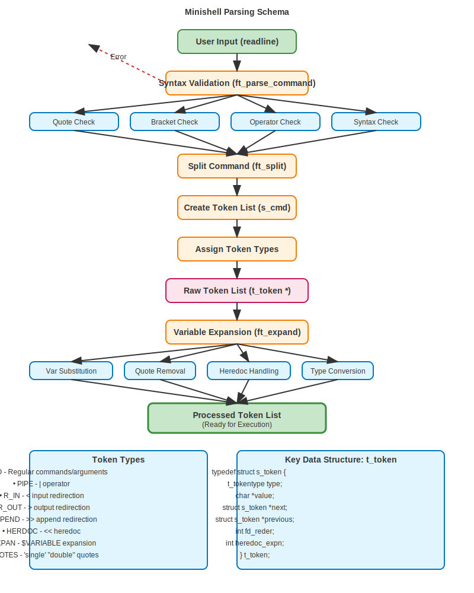
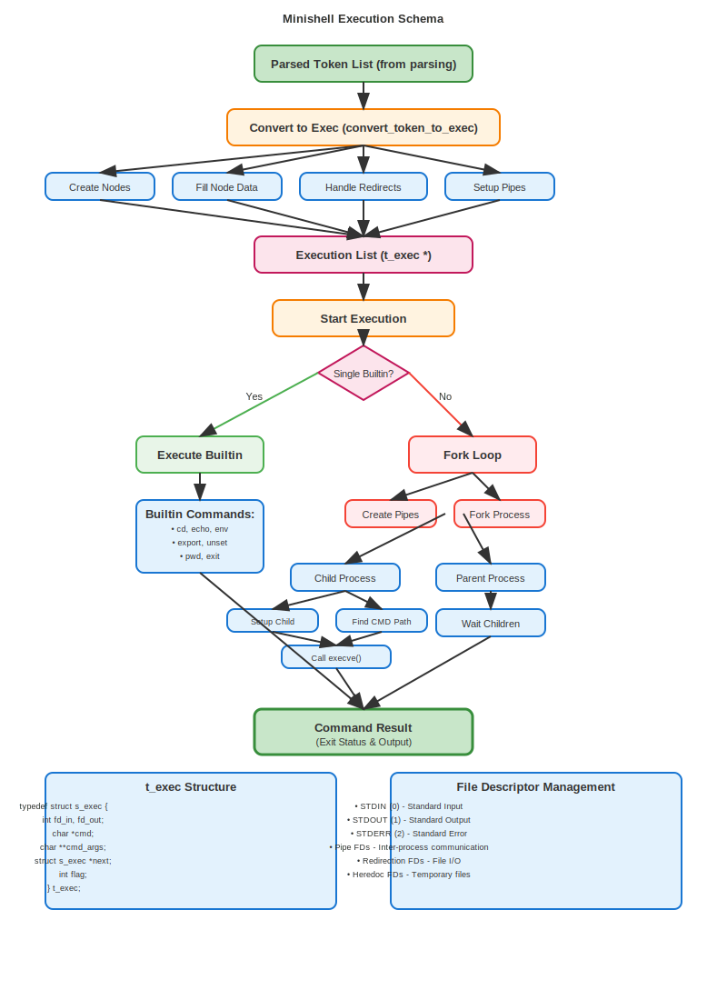

# Minishell System Architecture Documentation

This document provides a comprehensive overview of the minishell project's architecture, detailing the complete flow from user input through parsing to command execution.

## Overview

Minishell is a simplified shell implementation that processes user commands through three main phases:
1. **Input Validation** - Syntax checking and error detection
2. **Parsing** - Tokenization, expansion, and structure creation
3. **Execution** - Command processing and result delivery

---

## System Flow Diagram

```
User Input → Parsing Phase → Execution Phase → Command Result
     ↓            ↓               ↓              ↓
  readline()  → Tokenize    → Fork/Exec    → Exit Status
              → Expand      → Builtins     → Output
              → Validate    → Pipes        → Files
```

---

## Parsing Flow

The parsing phase transforms raw user input into a structured token list ready for execution.

### Parsing Schema Diagram


**Explanation:**
The parsing flow begins with user input from readline and progresses through multiple validation and transformation stages. Input is first validated for syntax correctness (quotes, brackets, operators), then split into tokens, classified by type, expanded for variables, and finally processed into a clean token list ready for execution.

### Detailed Structure Analysis
For a complete trace showing exact struct contents and linked list connections at each stage, see:
- **[DETAILED_STRUCT_FLOW.md](DETAILED_STRUCT_FLOW.md)** - Shows actual t_token and t_exec structures with real data
- **[detailed_struct_schema.svg](detailed_struct_schema.svg)** - Visual diagram with struct contents

### Key Components:

#### 1. Input Validation (`ft_parse_command`)
- **Quote Validation** (`ft_check_quots`): Ensures proper quote pairing
- **Bracket Validation** (`ft_check_braces`): Validates brace syntax
- **Operator Validation** (`ft_syntax_check`): Checks redirection and pipe operators

#### 2. Tokenization (`s_cmd`)
- **Command Splitting** (`ft_split`): Breaks input into individual tokens
- **Token Type Assignment** (`ft_token_type`): Assigns semantic meaning to tokens
- **Token List Creation**: Builds doubly-linked list of tokens

#### 3. Variable Expansion (`ft_expand`)
- **Variable Substitution** (`exp_val`): Replaces `$VAR` with environment values
- **Quote Removal** (`remove_q`): Strips surrounding quotes
- **Heredoc Processing** (`handle_heredoc`): Handles `<<` operations

### Token Types:
```c
typedef enum e_tokentype {
    WORD,        // Regular command/argument
    PIPE,        // | operator
    R_IN,        // < input redirection
    R_OUT,       // > output redirection
    APPEND,      // >> append redirection
    HERDOC,      // << heredoc
    EXPAN,       // $VARIABLE expansion
    SINGLE_Q,    // 'single quoted'
    DOUBLE_Q,    // "double quoted"
    DELEMTER,    // heredoc delimiter
    RED_FILE     // redirection target file
} t_tokentype;
```

### Data Structures:
```c
typedef struct s_token {
    t_tokentype     type;           // Token classification
    char           *value;          // Token content
    struct s_token *next;           // Next token in list
    struct s_token *previous;       // Previous token in list
    int            fd_reder;        // File descriptor for redirections
    int            heredoc_expn;    // Heredoc expansion flag
    int            ambg;           // Ambiguous redirection flag
    int            removed;        // Removal flag for processing
} t_token;
```

### Processing Flow:
1. **Input**: Raw command string from readline
2. **Validation**: Syntax checking (quotes, operators, brackets)
3. **Splitting**: Break into individual components
4. **Classification**: Assign token types based on content
5. **Expansion**: Process variables and perform substitutions
6. **Finalization**: Clean quotes and prepare for execution

---

## Execution Flow

The execution phase processes the parsed token list and executes commands.

### Execution Schema Diagram


**Explanation:**
The execution flow receives the processed token list from parsing and converts it into execution nodes. The system then decides between direct builtin execution (single process) or fork-based execution for external commands and pipelines. File descriptors are carefully managed for proper I/O redirection and inter-process communication.

### Advanced Command Examples
For complex scenarios with detailed struct analysis:
- **[HEREDOC_VARIABLE_ANALYSIS.md](HEREDOC_VARIABLE_ANALYSIS.md)** - Heredoc processing with environment variables
- **[detailed_struct_schema.svg](detailed_struct_schema.svg)** - Complete data structure visualization

### Key Components:

#### 1. Token-to-Exec Conversion (`convert_token_to_exec`)
- **Node Creation** (`new_node`): Creates execution nodes
- **Data Population** (`fill_node`): Fills command and argument data
- **Redirection Handling** (`handle_redirects`): Sets up file descriptors
- **Pipe Setup**: Links commands in pipeline

#### 2. Execution Decision (`execution`)
- **Builtin Detection**: Checks if command is a shell builtin
- **Single Command**: Direct execution for single builtins
- **Pipeline**: Fork-based execution for complex commands

#### 3. Command Execution
- **Builtin Commands**: Direct function calls (cd, echo, env, export, unset, pwd, exit)
- **External Commands**: Fork/exec with PATH resolution
- **Pipeline Management**: Pipe setup and file descriptor management

### Data Structures:
```c
typedef struct s_exec {
    int            fd_in;      // Input file descriptor
    int            fd_out;     // Output file descriptor
    char          *cmd;        // Command path/name
    char         **cmd_args;   // Argument array
    struct s_exec *next;       // Next command in pipeline
    int           flag;        // Error flag
} t_exec;
```

### Execution Paths:

#### Builtin Commands (Single Process):
```
Token List → Exec Node → Builtin Check → Direct Function Call → Result
```

#### External Commands (Fork/Exec):
```
Token List → Exec Node → Fork → Child: execve() → Parent: wait() → Result
                              → Child: setup_child()
                              → Child: find_cmd_path()
```

#### Pipeline Execution:
```
Token List → Multiple Exec Nodes → pipe() → fork() for each → connect with pipes → wait_all()
```

---

## File Descriptor Management

The system carefully manages file descriptors for proper I/O redirection:

- **Standard FDs**: stdin(0), stdout(1), stderr(2)
- **Pipe FDs**: Created with `pipe()` system call
- **Redirection FDs**: Opened files for `<`, `>`, `>>`
- **Heredoc FDs**: Temporary files for `<<` operations

### Redirection Types:
- `<` **Input Redirection**: Redirect stdin from file
- `>` **Output Redirection**: Redirect stdout to file (truncate)
- `>>` **Append Redirection**: Redirect stdout to file (append)
- `<<` **Heredoc**: Redirect stdin from user input until delimiter

---

## Error Handling

The system implements comprehensive error handling:

### Parsing Errors:
- Unclosed quotes
- Invalid operator sequences
- Missing redirection targets
- Syntax errors

### Execution Errors:
- Command not found (127)
- Permission denied (126)
- File descriptor errors
- Fork/exec failures

### Signal Handling:
- `SIGINT` (Ctrl+C): Interrupt current command
- `SIGQUIT` (Ctrl+\): Quit with core dump
- Heredoc signal handling for clean termination

---

## Memory Management

The system uses a custom memory allocator (`ft_malloc`) with:
- **ALLOC**: Allocate and track memory
- **CLEAR_DATA**: Free all tracked allocations
- Automatic cleanup on exit or error

---

## Key Functions Reference

### Parsing Functions:
- `ft_parse_command()`: Main parsing validation
- `s_cmd()`: Tokenization and list creation
- `ft_expand()`: Variable expansion and quote removal
- `ft_token_type()`: Token classification

### Execution Functions:
- `execution()`: Main execution coordinator
- `convert_token_to_exec()`: Transform tokens to exec nodes
- `execute_cmd()`: Fork and execute single command
- `execute_builtin()`: Direct builtin execution

### Utility Functions:
- `ft_split()`: String splitting utility
- `find_env()`: Environment variable lookup
- `get_cmd_path()`: Command path resolution
- `handle_redirects()`: File descriptor management

---

## Architecture Benefits

1. **Modular Design**: Clear separation between parsing and execution
2. **Robust Error Handling**: Comprehensive validation and error reporting
3. **Memory Safety**: Custom allocator with automatic cleanup
4. **Signal Safety**: Proper signal handling for interactive use
5. **Extensibility**: Easy to add new builtins or features

---

## Conclusion

The minishell architecture provides a clean, maintainable implementation of a Unix shell with proper separation of concerns, robust error handling, and efficient execution of both builtin and external commands. The parsing phase ensures command correctness before execution, while the execution phase handles complex scenarios like pipelines and redirections with proper process management.
