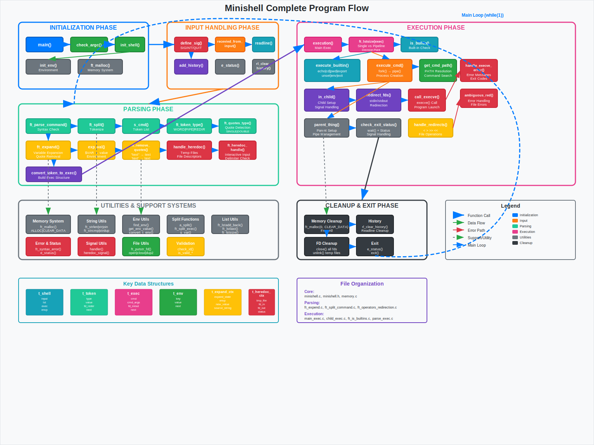
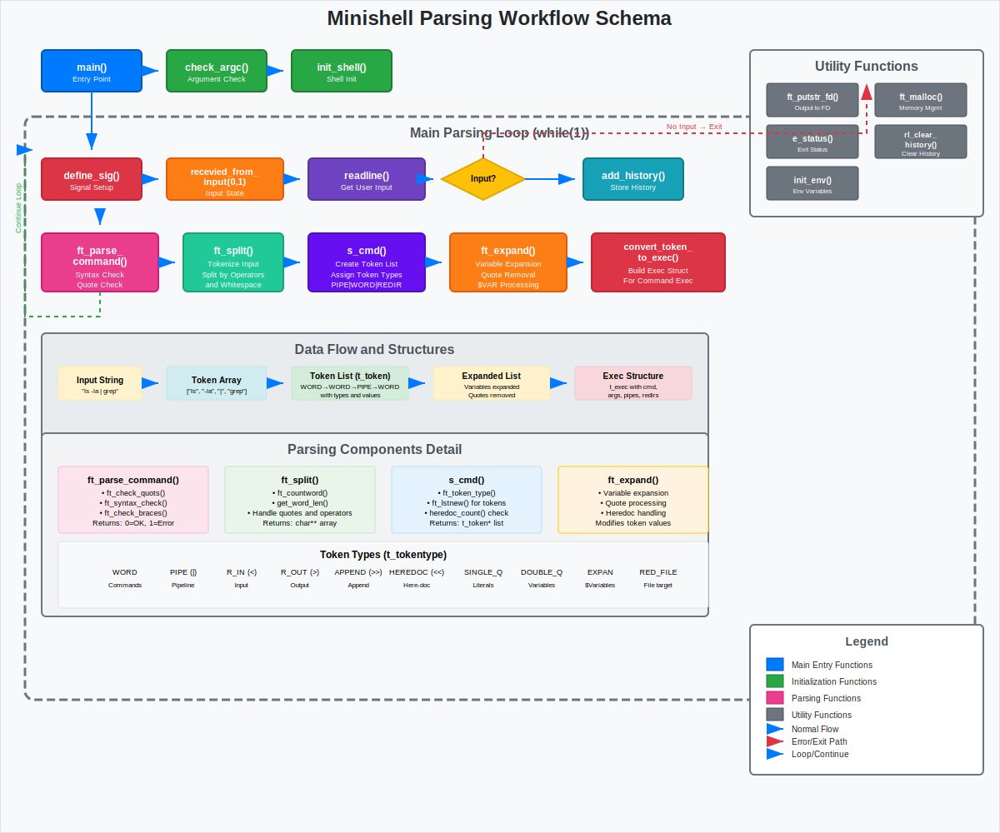
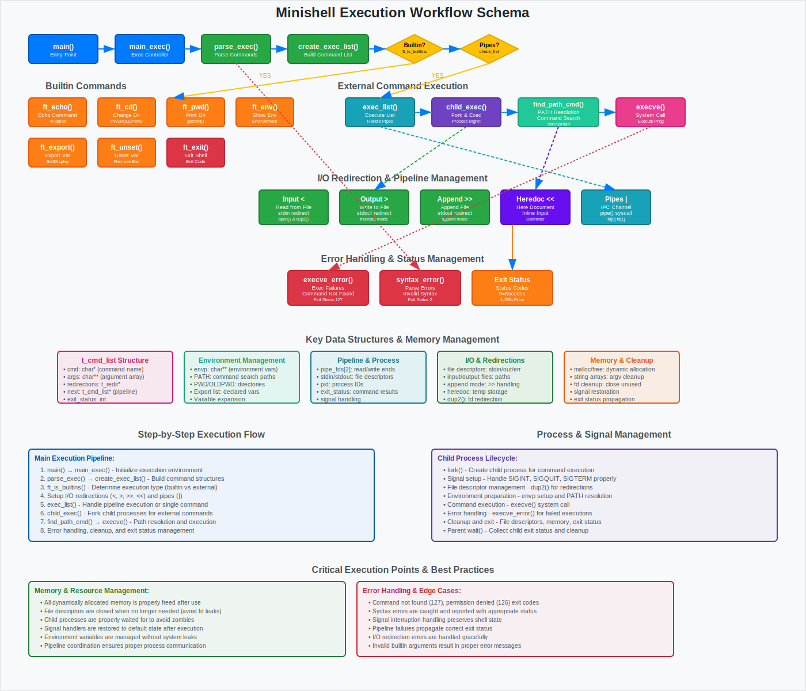
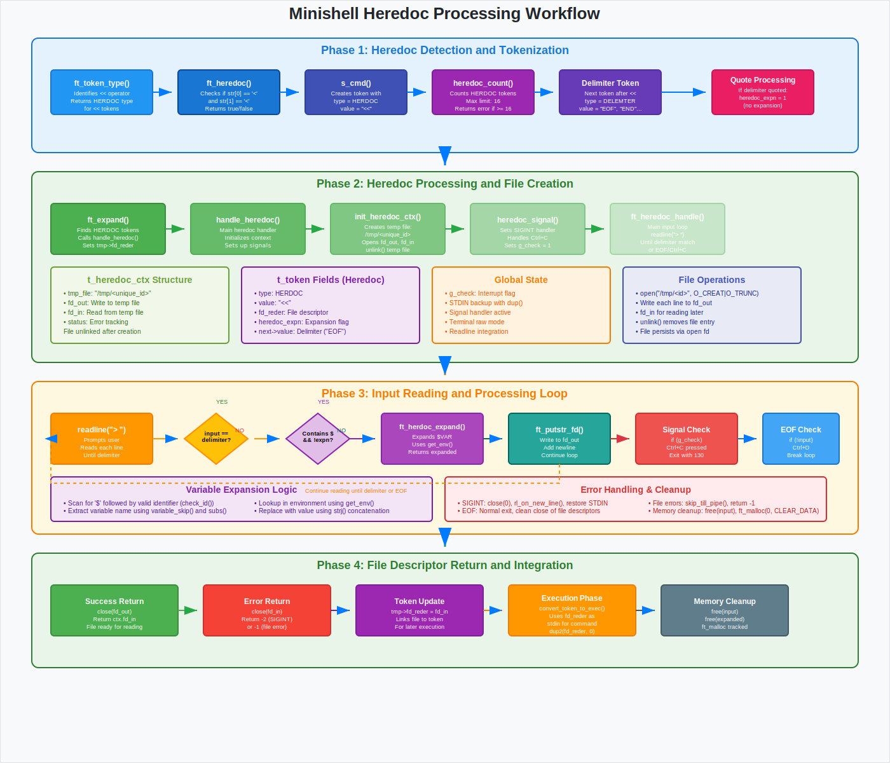

# Minishell


A minimal Unix shell implementation in C, designed to replicate the behavior of bash with essential features including command execution, pipes, redirections, environment variable management, and built-in commands.

## Table of Contents

- [Project Overview](#project-overview)
- [Key Features](#key-features)
- [Installation](#installation)
- [Usage](#usage)
- [Project Structure](#project-structure)
- [Architecture & Code Flow](#architecture--code-flow)
- [Built-in Commands](#built-in-commands)
- [Examples](#examples)
- [Contributing](#contributing)
- [License](#license)

## Project Overview

Minishell is a Unix shell implementation developed as part of the 42 School curriculum. It provides a command-line interface that interprets and executes commands, manages processes, handles file redirections, and provides essential shell functionality similar to bash.

The project demonstrates proficiency in:
- System calls and process management
- Memory management and data structures
- Signal handling and error management
- Parsing and lexical analysis
- Inter-process communication (pipes)

## Key Features

### Core Functionality
- **Command Execution**: Run system commands and custom programs
- **Pipes**: Support for command chaining with `|` operator
- **Redirections**: Input (`<`), output (`>`), and append (`>>`) redirections
- **Heredoc**: Multi-line input with `<<` delimiter
- **Quote Handling**: Proper parsing of single (`'`) and double (`"`) quotes
- **Environment Variables**: Variable expansion with `$` syntax
- **Signal Management**: Proper handling of SIGINT (Ctrl+C) and SIGQUIT (Ctrl+\)

### Built-in Commands
- `echo` with `-n` option
- `cd` with relative and absolute paths
- `pwd` - print working directory
- `export` - set environment variables
- `unset` - remove environment variables
- `env` - display environment variables
- `exit` - exit the shell with status code

### Advanced Features
- **Memory Management**: Custom memory allocation system with automatic cleanup
- **Error Handling**: Comprehensive error messages and status codes
- **Ambiguous Redirections**: Detection and handling of ambiguous redirections
- **Command History**: Integration with GNU Readline library
- **Path Resolution**: Automatic command path resolution using PATH variable

## Installation

### Prerequisites

Make sure you have the following dependencies installed:

```bash
# Ubuntu/Debian
sudo apt-get install build-essential libreadline-dev

# macOS
brew install readline
```

### Clone and Build

```bash
# Clone the repository
git clone https://github.com/yourusername/minishell.git
cd minishell/minishel

# Build the project
make

# The executable 'minishell' will be created in the current directory
```

### Clean Build

```bash
# Clean object files
make clean

# Clean everything including executable
make fclean

# Rebuild everything
make re
```

## Usage

### Starting the Shell

```bash
./minishell
```

You'll see the prompt:
```
minishell-> 
```

### Basic Commands

```bash
# Execute simple commands
minishell-> ls -la
minishell-> pwd
minishell-> echo "Hello, World!"

# Change directories
minishell-> cd /home/user
minishell-> cd ..
minishell-> cd

# Environment variables
minishell-> export MY_VAR="Hello"
minishell-> echo $MY_VAR
minishell-> env | grep MY_VAR
minishell-> unset MY_VAR
```

### Pipes and Redirections

```bash
# Pipes
minishell-> ls | grep .c | wc -l
minishell-> cat file.txt | sort | uniq

# Redirections
minishell-> echo "test" > output.txt
minishell-> cat < input.txt
minishell-> ls >> logfile.txt

# Heredoc
minishell-> cat << EOF
> This is a heredoc
> Multiple lines supported
> EOF
```

### Exit the Shell

```bash
minishell-> exit
# or
minishell-> exit 42  # Exit with specific status code
```

## Project Structure

```
minishel/
├── minishell.c          # Main program entry point
├── minishell.h          # Header file with all declarations
├── memory.c             # Custom memory management system
├── Makefile            # Build configuration
│
├── exec/               # Command execution module
│   ├── main_exec.c     # Main execution logic
│   ├── child_exec.c    # Child process management
│   ├── parse_exec.c    # Parse tokens to execution structure
│   ├── ft_*.c          # Built-in commands implementation
│   └── exec_*.c        # Execution utilities
│
├── parse/              # Parsing and tokenization module
│   ├── ft_split_command.c    # Command splitting
│   ├── ft_expand*.c          # Variable expansion
│   ├── ft_operators*.c       # Operator parsing
│   └── ft_*.c               # Parsing utilities
│
└── utils/              # Utility functions
    ├── ft_*.c          # String manipulation functions
    ├── split_*.c       # Advanced splitting functions
    └── ft_calloc.c     # Memory allocation utilities
```

## Architecture & Code Flow

The minishell follows a modular architecture with clear separation of concerns, implementing a complete shell workflow from input parsing to command execution.

### Workflow Overview


The complete shell workflow from input to execution, showing how user commands flow through the system.

### Parsing Workflow


Details the tokenization and parsing process, including quote handling and variable expansion.

### Execution Workflow


Shows how parsed commands are converted to executable structures and processed.

### Heredoc Workflow


Detailed flow for handling heredoc operations with proper signal management.

### Processing Pipeline

1. **Input Reading**: Uses GNU Readline for command input with history support
2. **Lexical Analysis**: Tokenizes input into meaningful components (words, operators, redirections)
3. **Syntax Validation**: Checks for proper command structure and syntax errors
4. **Variable Expansion**: Expands environment variables and handles quote processing
5. **Command Parsing**: Converts tokens into executable command structures
6. **Process Management**: Creates child processes and handles pipes/redirections
7. **Execution**: Runs built-in commands or external programs via execve
8. **Cleanup**: Manages memory and file descriptors

### Core Components

1. **Lexical Analysis** (`parse/`): Tokenizes input into meaningful components
2. **Syntax Analysis** (`parse/`): Validates command structure and handles expansions  
3. **Execution Engine** (`exec/`): Manages process creation and command execution
4. **Memory Manager** (`memory.c`): Tracks and manages all dynamic allocations
5. **Built-in Commands** (`exec/ft_*.c`): Implements shell built-in functionality

### Data Structures

- **t_token**: Represents individual command components (words, operators, redirections)
- **t_exec**: Execution node containing command, arguments, and file descriptors
- **t_env**: Environment variable linked list
- **t_memory**: Memory tracking for automatic cleanup

## Built-in Commands

### `echo` - Display Text
```bash
minishell-> echo "Hello World"
Hello World
minishell-> echo -n "No newline"
No newline
```

### `cd` - Change Directory
```bash
minishell-> cd /home/user      # Absolute path
minishell-> cd Documents       # Relative path
minishell-> cd                 # Go to HOME directory
minishell-> cd ..              # Parent directory
```

### `pwd` - Print Working Directory
```bash
minishell-> pwd
/home/user/project
```

### `export` - Set Environment Variables
```bash
minishell-> export PATH="/usr/local/bin:$PATH"
minishell-> export MY_VAR="value"
minishell-> export              # Display all variables
```

### `unset` - Remove Variables
```bash
minishell-> unset MY_VAR
minishell-> unset PATH USER     # Multiple variables
```

### `env` - Display Environment
```bash
minishell-> env
PATH=/usr/bin:/bin
HOME=/home/user
...
```

### `exit` - Exit Shell
```bash
minishell-> exit               # Exit with last status
minishell-> exit 0             # Exit with specific code
minishell-> exit 42
```

## Examples

### Complex Command Examples

```bash
# Multi-pipe command
minishell-> ps aux | grep bash | awk '{print $2}' | head -5

# Redirection with pipes
minishell-> cat file.txt | grep "pattern" > results.txt

# Variable expansion in commands
minishell-> export DIR="/tmp"
minishell-> ls $DIR/*.txt

# Heredoc with variable expansion
minishell-> cat << END > config.txt
> Server: $HOSTNAME
> Port: 8080
> END

# Complex redirection
minishell-> (echo "stdout"; echo "stderr" >&2) 2>error.log 1>output.log
```

### Error Handling Examples

```bash
# Command not found
minishell-> nonexistent_command
nonexistent_command: command not found

# Permission denied
minishell-> /etc/shadow
/etc/shadow: Permission denied

# Ambiguous redirection
minishell-> echo test > $EMPTY_VAR
minishell : ambiguous redirect
```

## Contributing

We welcome contributions! Please follow these guidelines:

### Development Setup

1. **Fork the repository**
2. **Create a feature branch**
   ```bash
   git checkout -b feature/amazing-feature
   ```
3. **Make your changes**
4. **Test thoroughly**
   ```bash
   make re
   ./minishell
   # Test various command combinations
   ```
5. **Commit with clear messages**
   ```bash
   git commit -m "Add: implement new pipe handling feature"
   ```
6. **Push to your fork**
   ```bash
   git push origin feature/amazing-feature
   ```
7. **Create a Pull Request**

### Coding Standards

- Follow the 42 School Norminette coding standard
- Use meaningful variable and function names
- Add comments for complex logic
- Ensure no memory leaks (test with valgrind)
- Handle all error cases appropriately

### Testing

```bash
# Basic functionality tests
make && ./minishell

# Memory leak testing
valgrind --leak-check=full --show-leak-kinds=all ./minishell

# Compare with bash behavior
echo "command" | ./minishell
echo "command" | bash
```

## License

This project is licensed under the MIT License - see the [LICENSE](LICENSE) file for details.

---

## Authors

- **Your Name** - [@yourusername](https://github.com/yourusername)
- **Collaborator** - [@collaborator](https://github.com/collaborator)

## Acknowledgments

- 42 School for the project specifications
- GNU Bash documentation for reference
- The readline library maintainers
- All contributors and testers

---

*This project is part of the 42 School curriculum. It demonstrates systems programming concepts and Unix shell implementation techniques.*
